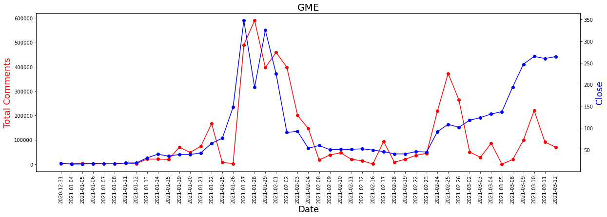
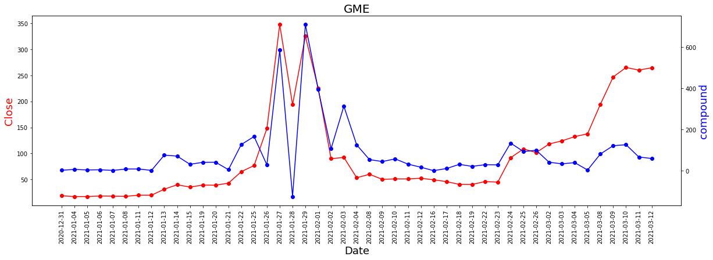
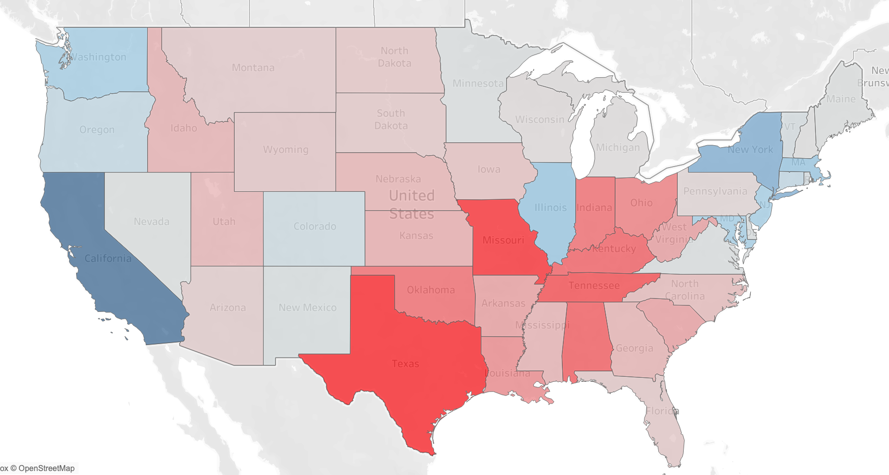
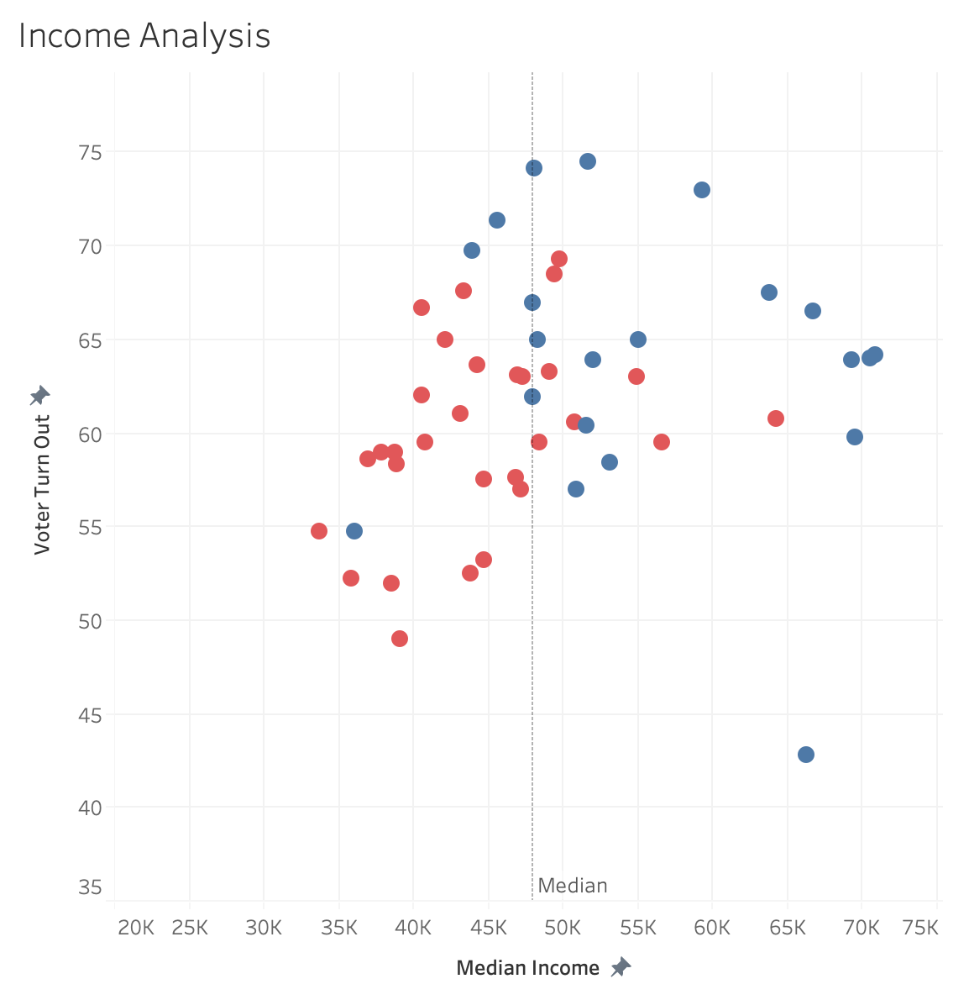
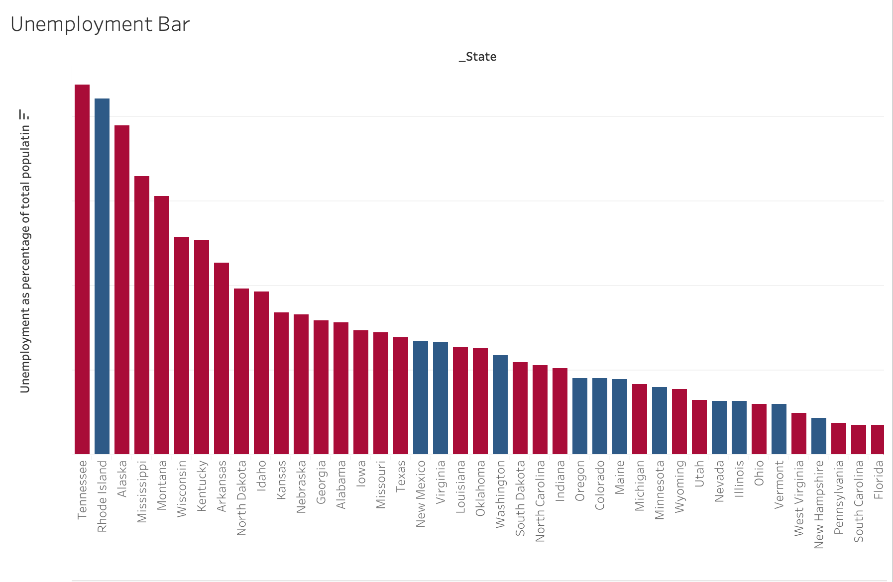
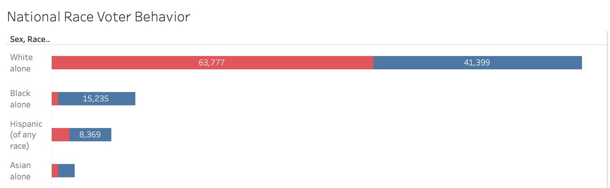

# [Project 1: eBay President's Day Price Evaluation](https://github.com/khristionk2/eBay-Project)

* Conducted a thorough analysis of eBay's Presidents Day sale on select products to determine if the presence of an original list price influences the number of items sold

## Product Image having sale price and original list price 

## Product Image with sale price having no original list price

## Data stored in SQL database

# [Project 2: Reddit - Wallstreetbets : Gamestop Analysis](https://github.com/khristionk2/Gamestop-WSB)

* The purpose of this project is to understand the unprecedented behavior of stocks, particularly Gamestop (GME), during the early part of 2021.
* I am seeking to understand what lead to this, through an analysis, exploring whether the comments and sentiments have a relationship with the volume and price of the stock

# Total Comments on Wallstreetbets & Close Price of GME

# Close Price of GME & Sentiment Score (Compound)

# [Project 3: COVID19 Forecasting](https://github.com/khristionk2/COVID-ARIMA-Forecasting)

* The purpose of this project is to learn ARIMA models and then apply that knowledge to forecast Covid cases and deaths.
* Utilizing ARIMA and Forecast Combination I was able to predict the next 30 days of COVID cases and deaths in Colorado.

## Colorado Cases
* The red line represents the COVID cases collected from Jan 22, 2020 to Feb 10, 2021
* The blue line represents the prediction forecast of cases for the next 30 days 

## Colorado Deaths
* The red line represents the COVID deaths collected from Jan 22, 2020 to Feb 10, 2021
* The blue line represents the prediction forecast of deaths for the next 30 days 

# [Projects 4: Diabetes Prediction](https://github.com/khristionk2/Diabetes-Prediction)
* The purpose of this project is to predict and identify patients who are at risk of diabetes so they seek medical intervention early. Determine the best machine learning model to predict the outcomes.

## Correlation Matrix of Numerical Variables

## Confusion Matrix & Classification Report

# [Project 5: Voter Behavior - Election 2016 ](https://github.com/khristionk2/Election-2016)
* This project takes a closer look into the 2016 Presidential Election to understand the behaviors of people across the nation and their voting behaviors
* Key areas focused on are income, employment, and ethnicity

# Election Results

# Income Trends
* You can see the majority of people who voted for Clinton had higher income than people who voter for Trump

# Employment Trends
* The majority of people who voted for Trump had higher unemployment rates

# Ethnicity Trends
* The majority of the white population voted for Trump, whereas the majority of the minority populations voted for Clinton

